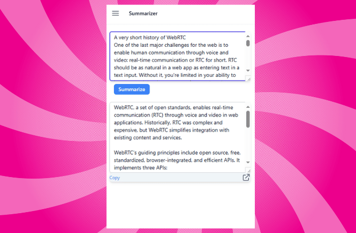

<h1> Make Easy AI </h1>
    
<h2> A Modern Browser Extension for Translation and Summarizing </h2>

 

* User Can Sign up and Login on the Extension.
* Supports more than 140 languages for translation.
* It use Google Cloud Translate API for Translations.
* Uses Gemini AI for Summarizing.

#### Build Technology: Webpack, React, TypeScript, Tailwind CSS, React Router Dom, Recoil, Axios

 

## [See The Back End of this Extension](https://github.com/sakibcy/MakeEasyAI-BackEnd)

